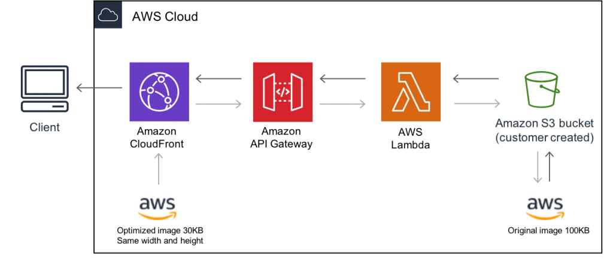

# Creating an Automatic Image Resizing Service with AWS Lambda
In this project, we'll build an automatic image resizing service using AWS Lambda, triggered by image uploads to an S3 bucket. This service is useful for automatically creating thumbnails or resizing images for various applications.



## Steps

### 1. Create an S3 Bucket

1. **Sign in to your AWS Management Console.**
2. **Navigate to the S3 service and create an S3 bucket** to store the images.

### 2. Create a Lambda Function

1. **Go to the Lambda service** in the AWS Management Console.
2. **Create a new Lambda function** using one of the supported runtimes (e.g., Node.js, Python).
3. **Configure the function** with an appropriate execution role that allows access to the S3 bucket.

### 3. Define Lambda Function Logic

Write the Lambda function code to automatically resize images when they are uploaded to the S3 bucket. We'll use the Pillow library for image processing in Python.

Here's a sample Lambda function code in Python:

```python
import json
import boto3
from PIL import Image
from io import BytesIO

s3_client = boto3.client('s3')

def lambda_handler(event, context):
    bucket_name = 'your-s3-bucket-name'
    target_bucket_name = 'your-target-s3-bucket-name'

    # Iterate through the S3 event records
    for record in event['Records']:
        # Get the S3 bucket and object key
        source_bucket = record['s3']['bucket']['name']
        object_key = record['s3']['object']['key']
        
        # Download the image from S3
        response = s3_client.get_object(Bucket=source_bucket, Key=object_key)
        image_content = response['Body'].read()
        
        # Open the image with Pillow
        image = Image.open(BytesIO(image_content))
        
        # Resize the image
        resized_image = image.resize((100, 100))
        
        # Save the resized image to a BytesIO object
        buffer = BytesIO()
        resized_image.save(buffer, 'JPEG')
        buffer.seek(0)
        
        # Upload the resized image to the target S3 bucket
        s3_client.put_object(Bucket=target_bucket_name, Key=f'resized-{object_key}', Body=buffer, ContentType='image/jpeg')

    return {
        'statusCode': 200,
        'body': json.dumps('Image resized and uploaded successfully')
    }
```

### 4. Configure S3 Event Trigger

1. **In the S3 bucket properties,** configure an event trigger that invokes the Lambda function when an image is uploaded.
   - Go to the S3 bucket.
   - Navigate to the **Properties** tab.
   - In the **Event notifications** section, click on **Create event notification**.
   - Configure the event to trigger on **ObjectCreated** and specify the Lambda function you created.

### 5. Testing

1. **Upload an image** to the S3 bucket.
2. **Monitor the Lambda function’s execution** in the AWS Lambda console.
3. **Check if the image is resized** and uploaded to the target S3 bucket.

### 6. Cleanup

1. **Terminate the Lambda function** to avoid ongoing charges.
2. **Delete the S3 bucket** if it's no longer needed.

## Conclusion

By following these steps, you have successfully created an automatic image resizing service using AWS Lambda and S3. This can be expanded for more complex workflows and integrated into larger systems, providing scalable and automated image processing capabilities.

Feel free to leave a comment if you have any questions or run into issues! Happy coding!
